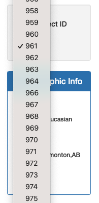
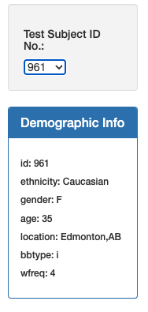
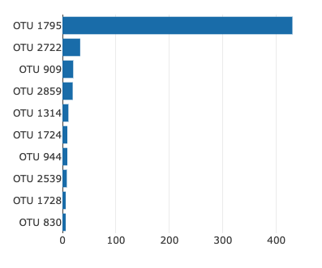
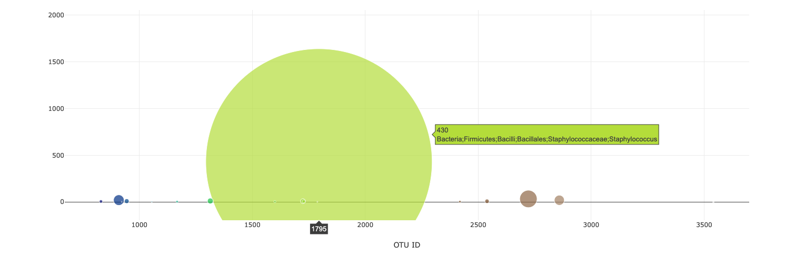
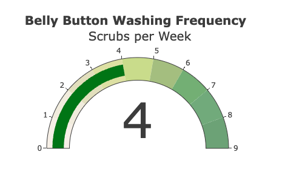

# belly-button-challenge

## Background

In this assignment, I buil an interactive dashboard to explore the Belly Button Biodiversity dataset, which catalogs the microbes that colonize human navels.

The dataset reveals that a small handful of microbial species (also called operational taxonomic units, or OTUs, in the study) were present in more than 70% of people, while the rest were relatively rare.

## Data Visualization Dashboard

Using the provided dashboard HTML template, the first step was to populate a click button for each test subject. Each subject would be identified by a unique ID that could be accessed from a dropdown menu. Beneath the dropdown menu, a demographic info chart would populate for the selected subject. 

     

## Horizontal Bar Chart

Next, using d3 and plotly, I created a horizontal bar chart to display the top 10 OTUs found in the selected individual subject.

## Bubble Chart

Next, using d3 and plotly, I created a bubble chart to display each bacteria sample found in the selected individual subject. The bubble chart features are defined as such:

1. Use otu_ids for the x values.

2. Use sample_values for the y values.

3. Use sample_values for the marker size.

4. Use otu_ids for the marker colors.

5. Use otu_labels for the text values.

## Gauge Chart

Lastly, I created a gauge chart to display the weekly washing frequency of each selected subject.

## Github Pages Deployment

The final step of this project was to set up a live deployment on Github Pages. Here is the link to my deployment page: https://jed-miller.github.io/belly-button-challenge/